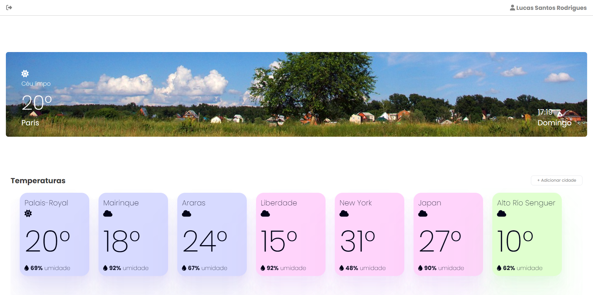
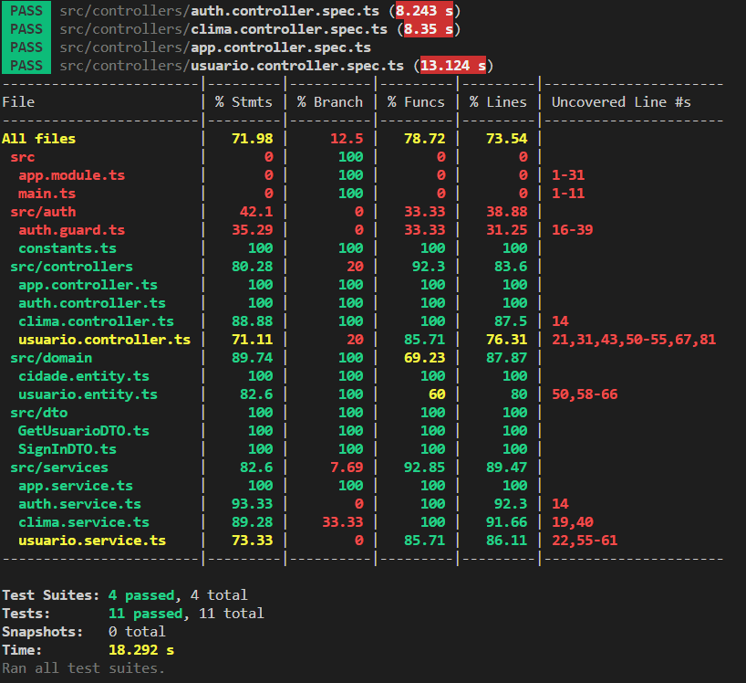

# ClimaTempo

Um dashboard pequeno onde o usuário pode se autenticar e acompanhar algumas informações meteorológicas de várias cidades ao redor do mundo.



## Requisitos

 - A interface do usuário deve ser construída usando React;
 - O back end deve ser construído usando NestJS;
 - Deve ser usado PostgreSQL para armazenar a lista de cidades que o usuário quer acompanhar e dados dos usuários;
 - Utilize a API de OpenWeatherMap para obter os dados de clima e;
 - A autenticação deve ser implementada.

## Funcionalidades

1. Autenticação de Usuário:
 - Os usuários devem ser capazes de se registrar, fazer login e logout e;
 - Os dados dos usuários devem ser armazenados de forma segura (ou seja, senhas devem ser devidamente criptografadas).
2. Dashboard:
 - Após se autenticarem, os usuários devem ser capazes de adicionar uma cidade ao seu dashboard e;
 - O dashboard deve exibir informações meteorológicas atuais para cada cidade adicionada, incluindo temperatura, umidade, e condição climática (por exemplo nublado, ensolarado, etc.).
3. Atualizações de Clima:
 - O dashboard deve atualizar automaticamente as informações climáticas a cada 15 minutos.

## Como rodar

Em um ambiente com [Docker e Docker Compose instalados](https://www.docker.com/), siga os passos:

 - Inicialize o Docker no seu sistema;
 - Crie um arquivo .env na raiz da pasta [/backend](./backend/) a partir do arquivo [.env-example](./backend/.env.example);
 - No arquivo [.env](./backend/.env) atribua a [sua chave do OpenWeatherApi](https://home.openweathermap.org/api_keys) a variável API_WEATHER_KEY;
 - Na [raiz do projeto](./) rode o comando:
 ```bash
 docker-compose up --build
 ```
 - Espere aparecer a mensagem `Nest application successfully started`;
 - Na mesma máquina que rodou o último comando acesse [http://localhost:3002](http://localhost:3002) e;
 - Aproveite!

## Trabalhos futuros

Dicas de como seguir com o projeto:

 - Adição de uma landing page;
 - Adição de uma página de perfil;
 - Criação de testes do frontend;
 - Aprimorar testes do backend com "mocks" e;
 - Adicionar verificação de email.

## Cobertura de testes

Backend - 70%:



Frontend - 0%.

## Acesse os outros READMES

### [Backend - Como rodar, desenvolver, informações e Endpoints!](./backend/README.md)

### [Frontend - Como rodar, desenvolver, informações e mais!](./frontend/README.md)